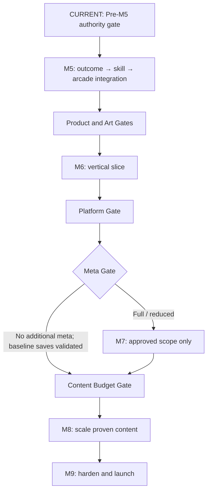

# Monster Girl Delivery — Roadmap

**Status:** APPROVED  
**Approved by:** Game Director / Product Owner  
**Originally approved:** 2026-09-03  
**Roadmap 3.0 revision:** 2026-09-12  
**Current milestone:** Pre-M5 transition (M4 complete; M5 parent #197 approved; implementation blocked by Pre-M5 exit gate)

> [!IMPORTANT]
> This file is the **single source of truth for milestone sequencing and milestone-level future scope**. `MASTER_SPEC.md` owns durable product/game decisions; focused GitHub Issues own live implementation scope.

This roadmap is organized around **proof**, not feature accumulation. Each milestone should answer one important development question before the project spends heavily on the next layer.

A documented future feature is not permission to implement it early. Every milestone still requires focused Issues, explicit dependencies, validation, Game Director review where relevant, and a factual closeout before advancing.

Historical reports in `docs/milestones/` record what actually happened and are not rewritten to match later planning.

---

## How to read this roadmap

Future milestones use five concepts:

- **Purpose** — why the milestone exists.
- **Proof question** — the question the milestone must answer.
- **Entry gate** — what must already be true before implementation begins.
- **Core scope** — the minimum capability needed to answer the proof question.
- **Exit gate** — the evidence/decision required before advancing.

Decision gates between milestones are intentionally not numbered as separate implementation milestones. They exist to prevent expensive production work from starting while a major product question is still unresolved.

---

# Parallel development tracks

These tracks run alongside the numbered milestones where useful. They do **not** authorize unrelated work or bypass milestone scope.

## A. Gameplay proof

Continuously evaluate whether the core runner is becoming:

- responsive;
- readable;
- fair;
- replayable;
- increasingly distinctive as Monster Girl Delivery.

Gameplay proof takes priority over adding breadth. A larger feature set does not compensate for a weak core run.

## B. Device, rendering, and performance

Validate important technical assumptions on representative real devices throughout development rather than postponing all mobile risk until release.

This includes, when promoted into focused work:

- phones and tablets;
- varied Landscape aspect ratios;
- safe areas and lifecycle behavior;
- high-DPI / device-pixel-ratio rendering;
- stable frame pacing and the 60 FPS target where target hardware permits;
- render-quality decisions that remain independent of final art style.

Current open rendering work such as Issue #102 may contribute to this track without becoming a new numbered milestone.

## C. Art pre-production

Before M6, low-cost art exploration is allowed when it reduces future rework.

Possible work includes:

- representative character/style tests;
- environment perspective and readability experiments;
- repeatable/parallax background tests;
- palette and silhouette exploration;
- animation-pipeline experiments;
- asset-format and production-workflow tests.

This track must not become production-scale asset creation before the core game and Art Gate justify it.

## D. Director / QA infrastructure

Developer tooling should grow only as needed to make the current systems observable, tunable, and reproducible.

Examples include:

- live prototype tuning;
- hitbox/debug views;
- seed/pattern visibility;
- difficulty/pacing state;
- restart-same-seed;
- test-state navigation;
- focused device/performance diagnostics.

Director tooling uses authoritative runtime state and must not become a second implementation of gameplay.

---

# Completed milestones

M0–M4 are complete. Reports own delivered scope, acceptance, and limitations; later correctness work does not rewrite history.

| Milestone | Closeout | Supporting evidence |
|---|---|---|
| M0 — Foundation | [Report](milestones/M0-foundation.md) | — |
| M1 — Flight Prototype | [Report](milestones/M1-flight-prototype.md) | [Device validation](milestones/M1-device-report.md) |
| M2 — Horizontal Run & First Hazard | [Report](milestones/M2-horizontal-run-first-hazard.md) | Parent #49 |
| M3 — Seeded Generation & Fairness | [Report](milestones/M3-seeded-generation-fairness.md) | [Validation](milestones/M3-seeded-run-validation.md), parent #57 |
| M4 — Run Pacing & Hazard Language | [Report](milestones/M4-run-pacing-hazard-language.md) | [Validation](milestones/M4-run-pacing-validation.md), parent #116 |

---

# Current — Pre-M5 Gameplay Authority Gate

**Status: CURRENT. M5 implementation is blocked; its parent plan is approved.**

[Issue #179](https://github.com/bongohorse/monster-girl-delivery/issues/179) owns the authority audit; [M5 parent #197](https://github.com/bongohorse/monster-girl-delivery/issues/197) owns the entry dependencies.

| Domain | Focused owner |
|---|---|
| Expanded flight-domain encounters / viewport-independent dominant-route pressure | #178 / #191 |
| Base flight model | #180 |
| Run speed / logical distance | #181 |
| Run metrics / event semantics | #182 |
| Hit / death / consequence ownership | #184 |
| Pacing / timing units | #183 — comparison completed in #179 |

### Exit evidence

- Each audit records **KEEP / ADJUST / REWORK / DEFER**, evidence, and its effect on M5 consumers.
- Blocking corrections are merged and validated; accepted deferrals name the limitation and why M5 can safely proceed.
- Collision/run-state stabilization is resolved or explicitly bounded as required by #197.
- #179/#197 record the explicit gate outcome before M5 is marked current.

KEEP and justified DEFER are valid outcomes. No rewrite, reference-game parity, or exhaustive APK research is required. Creating a follow-up alone does not resolve an M5-blocking dependency.

---

# Core-game proof phase

## M5 — Complete Arcade Loop & Skill Layer

**Purpose:** turn the procedural runner into a coherent arcade game that has a meaningful skill layer and encourages immediate replay before a large meta layer is built.

### Proof question

> Is the core game itself compelling enough that a player would voluntarily start another run even before deep progression, collection, or live-service systems exist?

### Entry gate

- M4 run pacing/hazard language is accepted;
- the core run can sustain representative generated play;
- focused parent plan [Issue #197](https://github.com/bongohorse/monster-girl-delivery/issues/197) is approved;
- implementation remains blocked until the Pre-M5 correctness/reference exit gate in #197/#179 is resolved sufficiently.

### Approved M5 design rules

- **Death is entertainment** — failure is part of the arcade loop, not an abrupt static stop.
- **One-action retry** — ordinary death to the next run must have minimal friction and no required menu round-trip.
- **Collectibles teach movement** — collectible paths should teach/guide movement and communicate safe versus optional-risk routes without tutorial text.
- **Failure still feels productive** — results should show meaningful authoritative run feedback without requiring the later meta economy.
- **Simple controls, temporary complexity** — preserve the one-button core; future vehicles/mounts/transformations should reinterpret the small input set rather than add permanent control clutter. Those temporary modes remain outside M5 implementation scope.

MGD does **not** adopt manufactured procedural unfairness as a retention tactic. Existing fairness, reachability, transition, pacing, and readability guarantees remain authoritative.

### Core scope

- complete start → run → crash → results → restart flow;
- extremely low-friction death-to-retry behavior;
- entertaining/readable fail-state presentation rather than an abrupt dead stop;
- separate lethal core hitbox and Graze layer;
- score foundation;
- collectible paths that support navigation/readability and optional risk/reward;
- basic run rewards sufficient to support results feedback;
- clear result presentation and meaningful run statistics;
- deterministic integration tests for the complete run lifecycle.

Promoted focused work is tracked by #198 (score/result snapshot/basic rewards), #90 (Graze), #84 (collectible paths), and #85 (fail-state/retry), subject to #197's entry gate and dependency ordering.

### Execution order within M5

These are execution steps, not new milestones or parallel ownership of run state.

| Step | Outcome | Owner / dependency |
|---|---|---|
| 1. Run outcome foundation | Authoritative score, immutable final result, basic feedback | #198 consumes Pre-M5 #182/#184 boundaries |
| 2. Skill / route layer | Graze, then teaching and optional-risk collectible paths | #90 → #84, consuming step 1 contracts |
| 3. Arcade loop integration | Death → results → one-action retry; lifecycle integration tests | #85 consumes steps 1–2 |
| Acceptance | Director replayability, pacing, MGD identity; factual closeout | #197 after integration |

#197 owns detailed ordering and evidence-backed dependency adjustments. Consumers reuse the same run-end/event/result authority; post-death presentation cannot alter score, distance, rewards, or the final snapshot.

### MGD identity acceptance

Placeholder assets are sufficient. In representative play, the Director should recognize the Monster Girl courier/delivery premise through existing character, pickup, failure, and result feedback while understanding the actual measured outcomes. Record the build, observations, and acceptance in the M5 closeout.

Delivery wording and inexpensive presentation cues are examples, not fixed copy or permission for Delivery Mode, contracts, parcel inventory, or production art. Do not imply a successful delivery, reward, or record that the build does not implement.

### Exit gate

M5 may close only when:

- the entire arcade loop works without requiring developer intervention between runs;
- Graze/score/collectibles produce a visible skill/risk layer rather than arbitrary numbers;
- death → results → retry friction is low enough for repeated playtesting;
- MGD identity acceptance above is recorded without introducing new delivery systems;
- bounded late-run speed and unintended dead zones are reviewed as required by #197; intentional breathers remain valid;
- the Game Director accepts the core game as sufficiently replayable/fun to justify production-quality presentation work;
- unresolved product questions that affect M6 are routed through the Product and Art Gates below;
- a factual M5 closeout is merged.

**Explicitly not part of M5:** final economy values, deep long-term progression, production-scale cosmetics/content, Companions/HQ systems, vehicles/mounts/transformations, Delivery Contracts, or unapproved alternate game modes.

---

# Pre-production decision gates

## Product Gate A — Define the release core game

**Timing:** after M5 and before expensive M6 production commitments.

### Decision question

> What is the core game structure MGD is actually trying to ship?

Evaluate, without assuming the answer in advance:

- Endless as the primary release mode;
- finishable Delivery Mode as a primary or complementary mode;
- both, if the additional structure is justified by evidence;
- whether delivery flavor remains thematic or becomes a stronger mechanical objective layer.

Possible inputs include lightweight prototypes/research if the decision cannot be made confidently from the M5 arcade loop.

### Gate output

The Game Director records the durable decision in `MASTER_SPEC.md`. Any resulting new gameplay scope must then be scheduled deliberately rather than silently inserted into M6.

If no additional delivery-mode complexity is justified, the project may continue with the proven Endless core.

---

## Art Gate — Lock the minimum production visual direction

**Timing:** after the core arcade game is proven and before M6 production assets are scaled.

### Decision question

> What visual and production approach can make MGD distinctive, readable, scalable, and performant on mobile?

Evaluate through representative tests rather than assumptions:

- pixel art vs. larger HD/cartoon/anime/chibi 2D or another approved direction;
- character proportions and gameplay silhouette scale;
- environment perspective/detail density;
- parallax/background construction;
- palette/outline/light/shadow principles where relevant;
- sprite/transform/secondary animation strategy;
- minimum asset naming/source/processing conventions;
- render sharpness and high-DPI behavior on representative devices.

Pixel art remains a useful prototype style, not an automatic final decision.

Skeletal/bone animation remains a later investigation unless a focused experiment proves that it is worth the production cost for the release direction.

### Gate output

Before M6 production scaling:

- the Game Director approves a production visual direction;
- render quality is suitable for evaluating the chosen style on modern displays;
- the minimum art-production conventions needed for the slice are documented in the appropriate source(s);
- major unresolved art-pipeline risks are identified rather than hidden inside M6 production.

---

# Production proof phase

## M6 — Vertical Slice / Visual Identity

**Purpose:** prove that a small, representative piece of Monster Girl Delivery can look, sound, feel, and perform like a near-finished game before content production scales.

### Proof question

> Can the team produce one coherent release-quality slice of MGD that preserves the proven arcade gameplay while establishing the game's real visual/audio identity on mobile?

### Entry gate

- M5 arcade-loop exit gate passed;
- Product Gate A resolved strongly enough to define the slice;
- Art Gate resolved strongly enough to produce representative assets;
- a provisional initial distribution target and representative device envelope are recorded for slice testing; this does not select a wrapper or change platform strategy by default;
- unresolved rendering/performance blockers that would invalidate visual evaluation are addressed or explicitly bounded.

### Target slice

- one production-quality Monster Girl;
- one representative themed district/environment;
- production-quality environment art for that slice;
- representative production hazards;
- character/world animation using the approved production approach;
- representative VFX;
- SFX and representative music treatment;
- polished HUD/run UI/results presentation;
- the proven arcade loop operating under production presentation;
- representative mobile performance validation.

### Exit gate

M6 may close only when:

- the slice reads clearly and feels coherent as Monster Girl Delivery rather than a dressed-up prototype;
- production art/audio/VFX do not undermine gameplay readability;
- representative real-device performance remains acceptable;
- the core art/animation/content pipeline can produce more content without obvious re-engineering;
- production effort/complexity observations are recorded for the later Content Budget Gate;
- the Game Director accepts the slice as the quality/reference target for content scaling;
- a factual M6 closeout is merged.

M6 proves a **quality bar and production approach**, not the final quantity of release content.

---

## Platform / Distribution Gate — Prove the initial shipping path

**Timing:** establish a provisional target before M6; resolve this gate using the M6 slice before persistence/content scaling depends on platform assumptions.

### Decision question

> Where will release 1 ship, and can the representative game operate through that distribution path?

Compare only plausible targets: mobile web, PWA if justified, Android and/or iOS packaging, or a suitable web portal. Preserve the mobile-first priority in `MASTER_SPEC.md`; evaluation does not approve all platforms or a new dependency.

### Gate output

- Director-selected initial target(s), deferred targets, and representative device/browser envelope;
- a small working build through the selected path on representative hardware, with reproduction steps and observed limitations;
- evidence for required capabilities: save/reload, audio/input user gestures, suspend/resume, safe areas, Landscape orientation, fullscreen where needed/supported, and cache/update behavior;
- identified distribution/store constraints and costs where applicable, with a feasible resolution for blockers;
- durable platform decision in `MASTER_SPEC.md`; technical ownership and build instructions in their canonical documents when implemented.

Use a bounded feasibility check, not full store-release preparation or speculative wrappers. If the path fails, revise the target or resolve the blocker before dependent work proceeds. M9 hardens this proven path rather than discovering packaging for the first time.

---

## Meta Gate — Define the minimum long-term progression target

**Timing:** after M6, informed by the Platform Gate, before committing to optional M7 work.

### Decision question

> What minimum progression/collection loop actually improves MGD without turning the project into several games at once?

Resolve enough of the following to design M7 safely:

- whether playable characters are mechanically identical, cosmetic-first, or small sidegrades;
- what players primarily earn from completed runs;
- what the minimum release collection target is;
- how important Gallery/character ownership is to the release loop;
- whether one simple currency/framework is sufficient initially;
- which large backlog systems are explicitly **not** needed for the first meta implementation.

### Gate output

Record one Director decision and its rationale in `MASTER_SPEC.md`:

| Outcome | Route |
|---|---|
| Meta justified | M7 proves one bounded progression/collection loop |
| Minimal | Reduce M7 to approved records/settings/small-unlock needs |
| No additional meta | Skip M7; proceed to Content Budget Gate once baseline persistence needs are satisfied |

Skipping meta does not waive required saving. Reuse existing records/settings storage; implement only missing approved needs through the centralized, versioned `SaveManager` boundary and recovery/migration requirements in `MASTER_SPEC.md`. Name the focused owner and validation before M8 if work remains. No currency, Gallery, or unlock framework without an approved consumer.

Record skipped M7 as **SKIPPED by decision**, never COMPLETE. No dummy implementation or milestone closeout is needed for work that did not happen.

---

## M7 — Optional / Minimal Meta & Persistence

**Purpose:** prove only the durable progression or minimal persistence scope selected by the Meta Gate after the arcade game and vertical slice.

### Proof question

> Does the selected persistent scope improve return play and survive reload safely? For full M7, prove earn → save → own/use → replay; for reduced M7, prove only the approved records/settings/unlocks.

### Entry gate

- M6 quality/production proof accepted;
- Meta Gate selects full or reduced M7 and defines exact scope;
- Platform Gate passes for the persistence/distribution assumptions used;
- M7 has a focused parent plan before implementation begins.

### Core scope — only as selected by the Meta Gate

Reduced M7 retains only the approved subset below; an economy/collection loop is not mandatory. Reuse existing records/settings foundations.

- centralized `SaveManager` boundary;
- versioned local persistence;
- explicit migrations;
- development export/import/reset;
- minimum economy/reward framework required by the approved loop;
- collection/ownership framework;
- Gallery and/or character/skin ownership where approved by the Meta Gate;
- completed-run reward integration;
- one complete flow such as:

```text
Run
→ earn reward/progress
→ save
→ unlock/own something
→ view/equip/use it
→ persistence survives reload
→ start another run
```

### Exit gate

M7 may close only when:

- the approved full or reduced scope works end-to-end;
- approved persisted data survives reload/restart as intended;
- versioning/migration behavior has deterministic coverage appropriate to the implementation;
- development recovery/export/import/reset paths exist;
- the meta layer does not require online accounts/backend infrastructure;
- the Game Director accepts the selected scope as useful rather than merely technically functional;
- a factual M7 closeout is merged.

**Explicitly not automatically part of M7:** paid/random monetization, Battle Pass, Dailies, Companions, fusion, HQ management, relationship systems, or every idea in `BACKLOG.md`.

The project remains local-first and offline-first for the initial scope. Real-money mechanics are not part of this roadmap.

---

# Content planning gate

## Content Budget Gate — Set an evidence-based release content target

**Timing:** after M6 and the Platform/Meta Gates, with selected M7 work accepted or M7 explicitly skipped and required baseline persistence validated; before M8 scales content.

### Decision question

> How much release content can be produced, validated, and polished at the proven quality level without destabilizing the project?

Use real observations from M6 and any implemented M7 scope to estimate relative production cost/complexity for items such as:

- one Monster Girl and animation set;
- one environment/district kit;
- one hazard archetype/pattern family;
- one cosmetic tier;
- UI/VFX/audio additions;
- validation/performance cost per content family.

Do not invent large content-count targets before this evidence exists.

### Gate output

The Game Director approves an evidence-based M8 release-content target. The target may be revised later if production measurements change, but M8 should begin with a bounded content plan rather than an unlimited backlog.

---

# Content and release phase

## M8 — Release Content Production

**Purpose:** scale systems, visual language, and meta foundations that were already proven into a bounded release-candidate content set.

### Proof question

> Can MGD scale its proven game without quality collapse, uncontrolled scope growth, or new foundation systems appearing during content production?

### Entry gate

- M6 vertical-slice quality bar accepted;
- Platform Gate passed; Meta Gate decision recorded;
- selected M7 scope accepted, or M7 explicitly skipped with required baseline persistence validated;
- Content Budget Gate produces a bounded release-content target;
- M8 has a focused production plan before broad implementation begins.

### Core scope may include, within the approved budget

- additional Monster Girls/skins;
- additional themed districts;
- larger validated pattern catalog;
- variations using proven hazard behavior contracts;
- additional animation, VFX, audio and UI content;
- boss/set-piece encounters only where previously proven/promoted;
- temporary gameplay events only where previously validated/promoted;
- Delivery Contracts or comparable objectives only if their systems were explicitly approved, prototyped, and accepted before M8;
- modular production-art scaling;
- content-performance optimization;
- content regression/readability validation.

### Exit gate

M8 may close only when:

- the approved release-content target is substantially complete or explicitly re-scoped by the Game Director;
- new content respects the M6 quality/readability bar;
- the pattern/hazard catalog remains validated rather than becoming uncontrolled content debt;
- content-scale performance remains within the current mobile target envelope;
- remaining work is primarily release polish, compatibility, packaging, compliance, or blocker fixes rather than missing core game systems;
- a factual M8 closeout is merged.

**Rule:** No new foundation systems in M8 by default. New quest/combat/vehicle/progression frameworks or physics architectures require explicit roadmap re-planning and a bounded accepted prototype before content depends on them. Bosses, temporary modes, and new hazard behaviors follow the same rule; backlog promotion alone is insufficient. Cut/defer an idea needing unproven foundations or revisit the plan rather than hiding foundation work in M8.

---

## M9 — Release Hardening & Launch

**Purpose:** turn the validated release-content build into a mobile release candidate and prepare broader distribution without destabilizing the proven game.

### Proof question

> Is MGD reliable, readable, performant, accessible enough, and correctly packaged on representative target devices to ship?

### Entry gate

- M8 content exit gate passed;
- release-candidate content scope is bounded;
- the Platform Gate shipping path is proven and still matches the selected release target;
- no known missing foundation system is being deferred into “polish.”

### Core scope

- sustained mobile performance tuning;
- high-DPI/render-scale validation across representative devices;
- safe-area and device-layout polish;
- accessibility pass appropriate to the game;
- mobile device matrix and regression testing;
- lifecycle/suspend/resume validation;
- hardening the shipping path proven at the Platform Gate; Android/iOS packaging only if selected;
- production build and packaging checks;
- store preparation/compliance work required for the chosen targets;
- release-blocker fixes;
- final release-candidate validation.

Desktop/Steam packaging may follow later and should not block the initial mobile-first release unless explicitly promoted.

### Exit gate

M9 completes only when:

- the chosen mobile release build passes the agreed device/regression matrix;
- required packaging/store checks are satisfied for the chosen release targets;
- no known release blocker remains open;
- performance/lifecycle/safe-area behavior is validated on representative real devices;
- the Game Director accepts the build as release-ready;
- the final release closeout records any known non-blocking limitations or post-release backlog.

---

# Development sequence

M0–M4 are complete. The current and future route is:



A provisional distribution target informs M6; the Platform Gate validates its shipping path afterward. Gates record decisions and evidence, not permission to build every option.

---

# Roadmap rules

- M0–M4 historical scope is not rewritten by later planning changes.
- The current milestone remains the only default implementation focus unless the Game Director explicitly authorizes cross-cutting work.
- A decision gate is not permission to prebuild every possible answer before the decision.
- Each selected future milestone needs a focused parent plan when its entry assumptions can be verified; optional milestones may be explicitly skipped.
- Parent Issues/milestones are planning containers; focused implementation work should remain independently reviewable where practical.
- Every milestone requires factual closeout evidence before advancing.
- Automated tests, manual/device evidence, and Game Director acceptance serve different purposes; do not substitute one for another.
- `PROTOTYPE`, `EXPERIMENT`, `TBD`, and `FUTURE` decisions remain non-final until explicitly approved.
- Production content should build on the M6 vertical slice rather than precede it at scale.
- Art pre-production may begin earlier when it reduces future rework; production asset scaling belongs after the Art Gate/core gameplay proof.
- Device/rendering/performance risks should be tested incrementally rather than deferred entirely to M9.
- Director/QA tooling grows with the systems that need observation; it is not a separate gameplay product.
- `BACKLOG.md` and `ENDLESS_RUNNER_BLUEPRINT.md` are inputs for promotion/research decisions, not scheduled work by themselves.
- If milestone sequencing changes, update this file rather than maintaining a competing roadmap elsewhere.
- Do not create future-milestone implementation Issues simply because this roadmap is more detailed. Create detailed Issue plans when the relevant milestone approaches and its entry assumptions can be verified.
